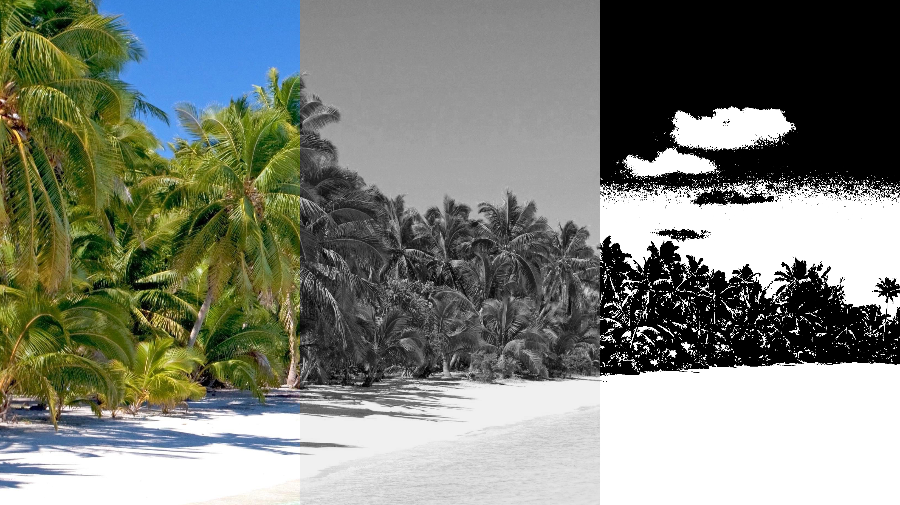
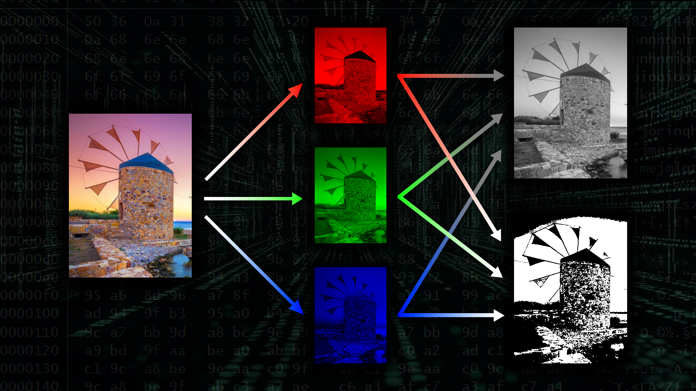
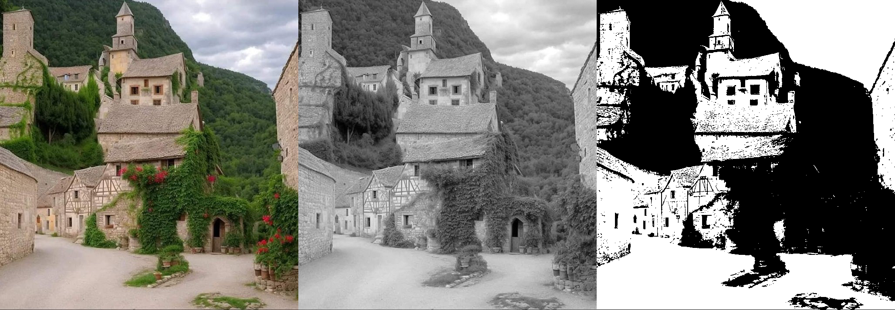

# Netshade

A constrained low-level image-processing pipeline built in C around the Netpbm image format family.



---

## Overview

Netshade is an academic image-processing project focused on direct manipulation of raw graphical data through grayscale conversion, binary threshold mapping, and sequential pixel-stream processing.

Unlike higher-level graphics applications relying on external imaging libraries, the project operates directly on ASCII and binary image data using manually implemented parsing and transformation logic.

The project was developed under unusually strict technical limitations designed to encourage low-level computational thinking and memory-aware programming techniques.

---

## Technical Constraints

The assignment intentionally prohibited:

- Arrays
- Strings
- Floating-point arithmetic
- Several standard helper utilities

As a result, the entire processing pipeline was implemented around:

- Sequential data handling
- Character-level parsing
- Stream-based computation
- Incremental transformation logic

---

## Supported Processing Operations

Netshade supports transformation between:

- Full-color image states
- Grayscale image states
- High-contrast binary threshold states

The application manually processes image headers, dimensions, and color values while converting between multiple Netpbm formats.

---

## About Netpbm

The Netpbm family of formats stores graphical information using intentionally simple and human-readable structures.

Because of their straightforward layout, Netpbm images are particularly useful for studying:

- Pixel representation
- Color encoding
- Image transformation
- Low-level graphical computation

### Netpbm Image Types

Netpbm images are identified through short "magic numbers" placed at the beginning of each file:

| Format | Description |
|---|---|
| P1 | ASCII black-and-white |
| P2 | ASCII grayscale |
| P3 | ASCII RGB color |
| P4 | Binary black-and-white |
| P5 | Binary grayscale |
| P6 | Binary RGB color |

Each file stores:

1. A format identifier (`P1`–`P6`)
2. Image dimensions
3. Maximum channel value (where applicable)
4. Raw pixel data

Because the structure is intentionally minimal and human-readable, Netpbm formats are especially useful for studying low-level graphical data representation and image transformation pipelines.

---

## Processing Pipeline

Rather than separating operations into isolated utilities, the project was designed around a unified processing flow capable of:

1. Loading image data
2. Parsing graphical information
3. Transforming pixel values
4. Exporting converted image states



---

## Example Transformations

### Color → Grayscale → Binary Threshold

The project progressively reduces visual information through computational transformation, demonstrating how image data can be abstracted into simplified graphical states.

---

## Repository Structure

```text
main.c
convert.c
netpbm.c

convert.h
netpbm.h

test_p3.ppm
test_p6.ppm
```

---

## Quick Start

### Compile

```bash
gcc main.c convert.c netpbm.c -o netshade
```

### Run

Convert a color image to grayscale:

```bash
./netshade < test_p6.ppm > output.pgm
```

Convert a grayscale image to binary black-and-white:

```bash
./netshade < test_p3.ppm > output.pbm
```

---

## Included Test Images

The repository includes two minimal Netpbm sample files for testing:

- `test_p6.ppm`
  - Binary RGB color image (P6)

- `test_p3.ppm`
  - ASCII RGB color image (P3)

These files can be used to verify both parsing and transformation behavior across different Netpbm encoding modes.

---

## Educational Focus

This project became an important introduction to:

- Low-level image processing
- Constrained problem solving
- Stream-based computation
- Sequential logic
- Systems-oriented programming
- The computational foundations of digital imaging



